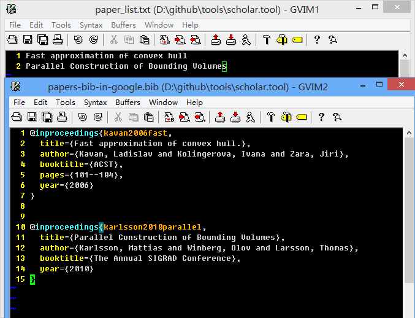

scholar.tool 
====

The tool used in [http://www.tanglei.name/bibtex-batch-export](http://www.tanglei.name/bibtex-batch-export/), which can Batch download or export bibtex data from google scholar.　Before you use this tool, you should have the python environment. You are welcome to give some sugguestion in [my blog](http://www.tanglei.name/bibtex-batch-export/).

Usage:

1. Open your browser like chrome, goto [scholar.google.com](http://scholar.google.com/).

2. Press F12 to open the develper tools, search any word, you can get the cookie from the first item, like [here](./usage.png), then copy the cookie into the file "\_cookie".

3. put all your paper name list in the file "paper\_list.txt", then run "main.py", the result will show in the current directory "papers-bib-in-google.bib", here is the example 

the command ```main.py paper_list.txt out.bib``` will parse the filenames stored in 'paper_list.txt' store the result in 'out.bib'.

the command ```singleOne.py title``` will output the parsed result to the standard output. For example 
	
	D:\github\scholarTool\scholar.tool>singeOne.py Hello
	@article{bradaschia1990virgo,
	  title={The VIRGO project: a wide band antenna for gravitational wave detection
	},
	  author={Bradaschia, C and Del Fabbro, R and Di Virgilio, A and Giazotto, A and
	 Kautzky, H and Montelatici, V and Passuello, D and Brillet, A and Cregut, O and
	 Hello, P and others},
	  journal={Nuclear Instruments and Methods in Physics Research Section A: Accele
	rators, Spectrometers, Detectors and Associated Equipment},
	  volume={289},
	  number={3},
	  pages={518--525},
	  year={1990},
	  publisher={Elsevier}
	}

