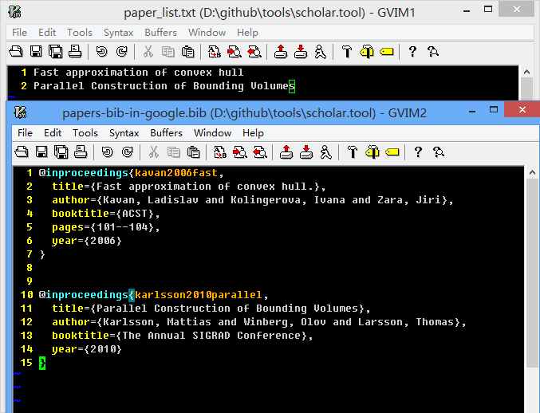

scholar.tool 
====

The tool used in http://www.tanglei.name/bibtex-batch-export/, which can Batch download or export bibtex data from google scholar.

Usage:

1. Open your browser like chrome, goto [scholar.google.com](http://scholar.google.com/).

2. Press F12 to open the develper tools, search any word, you can get the cookie from the first item, like [here](https://raw.github.com/tl3shi/tools/master/scholar.tool/usage.png), then copy the cookie into the file "\_cookie".

3. put all your paper name list in the file "paper\_list.txt", then run "main.py", the result will show in the current directory "papers-bib-in-google.bib", here is the example 

